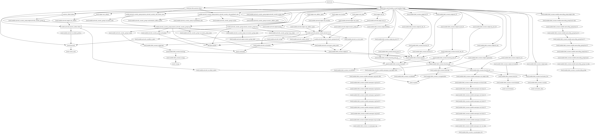

# Azure network for single application

This builds a very opinionated Azure network.

Builds a single purpose network designed for a single application that
will have multiple systems.

Uses minimal input to generate standardized
names for everything.

Will have 1 subnet that matches the address space

<!-- BEGINNING OF PRE-COMMIT-TERRAFORM DOCS HOOK -->

## Inputs

| Name | Description | Type | Default | Required |
|------|-------------|:----:|:-----:|:-----:|
| environment | Deployment stage/environment name | string | `test` | no |
| location | The location/region where the core network will be created. The full list of Azure regions can be found at https://azure.microsoft.com/regions | string | `westus` | no |
| location_short | Short standardized location name for use in all resource names | string | `usw` | no |
| net_octet | Third octet of IP address. Used to build address space and subnet CIDR | string | `0` | no |
| prefix | Prefix for resource names | string | `proxy` | no |
| tags | The tags to associate with network and subnets | map | `<map>` | no |

## Outputs

| Name | Description |
|------|-------------|
| vnet_address_space | The address space of the vNet |
| vnet_id | The ID of the vNet |
| vnet_location | The location of the vNet |
| vnet_name | The Name of the vNet |
| vnet_subnets | The IDs of subnets in the vNet |

<!-- END OF PRE-COMMIT-TERRAFORM DOCS HOOK -->
<!-- BEGINNING OF PRE-COMMIT-TERRAFORM GRAPH HOOK -->

### Resource Graph of plan

<!-- END OF PRE-COMMIT-TERRAFORM GRAPH HOOK -->
